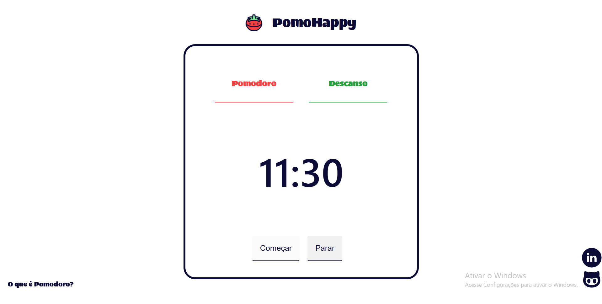

# PomoHappy 🍅

**Descrição Breve:** Página utilizada para melhor desempenho e foco entre atividades do usuário. É utilizado no site o método Pomodoro.

**Preview do Projeto:** 


## 🚀 Tecnologias Usadas
 - HTML5
 - CSS3
 - Javascript

## Página web
<a href="https://armandyncoder.github.io/PomoHappy/" target="black" >PomoHappy</a>

## Estrutura de Pastas 

```
PomodoTimer/
│    ├── assets/
│    │      ├── audio/
│    │      └── img/
│    ├── css/
│    └── js/
└── index.html
```

## Feito por <a href="https://github.com/ArmandynCoder" target="blank" >Armando Eduardo</a>